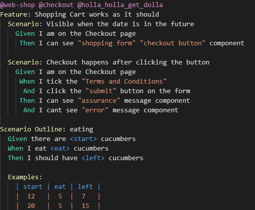

# Feature Syntax Highlight and Snippets README

## Description

This extension provides syntax highlight and snippets for .feature files to enhance productivity (and make .feature files look pretty :) )

### Functionality
- Highlights keywords including:
  - **Scenario**
  - **Feature**
  - **Given**
  - **When**
  - **Then**
  - **And**
  - **But**
  - **@tags**

- Snippets for fast .feature file editing
  - **ff**: **F**eature file skeleton including a Scenario
  - **fs**: **S**cenario skeletion with Given, When and Then
  - **fb**: Given-When-Then **B**lock
  - **fg**: **G**iven
  - **fw**: **W**hen
  - **ft**: **T**hen
  - **fa**: **A**nd

This description will be more updated to be more useful in a bit :)

## Author
Roland Orosz (Blodwynn)
blodwynn@hotmail.com

